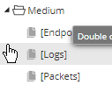
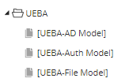

#Investigation Profiles

Collection of Investigation Profiles, metagroups and columngroups to help organize metadata for investigations

## Profiles
These are pre-queries that help when you don't remember the name of the service or other drills and allow you to set your pivots and then select the metagroup and columngroup to match your investigation (or pivot between a few different groups)

[Medium]

[UEBA]

[Log Device Classes]

[Protocols]

## Meta Groups
[basic start]

[crypto traffic]

[email investigation]

[filename]

[manual pcap upload]

[outbound http]

## Column Groups
[other]

[outbound http]

[tftp]

[ftp]

[ssl]

[ssh]

[smb]

[securidaccess]

[rdp]

[passive-dns]

[ja3]

[irc]
